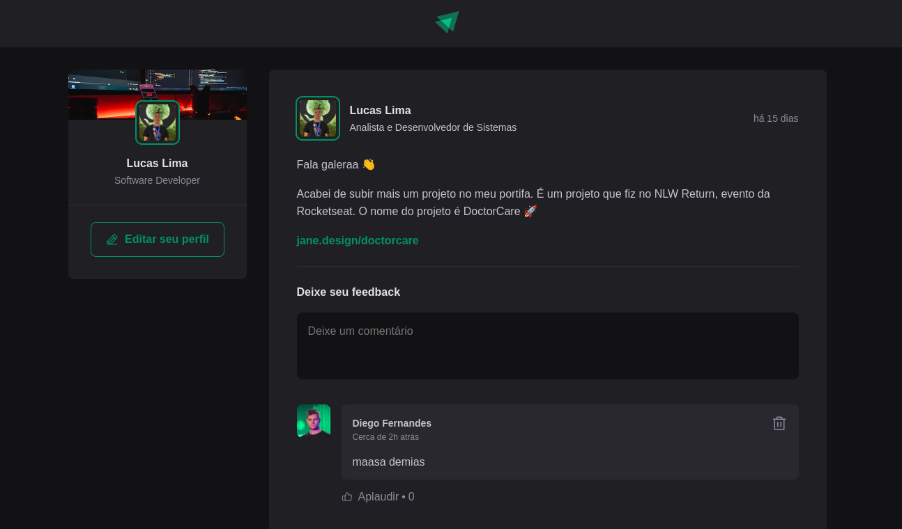

  <a href="#-tecnologias">Tecnologias</a>&nbsp;&nbsp;&nbsp;|&nbsp;&nbsp;&nbsp;
  <a href="#-projeto">Projeto</a>&nbsp;&nbsp;&nbsp;|&nbsp;&nbsp;&nbsp;
  <a href="#memo-licença">Licença</a>

  

 

  

## 🚀 Tecnologias

Esse projeto foi desenvolvido com as seguintes tecnologias:

- [Node e NPM](https://nodejs.org/)
- [Vite](https://vitejs.dev/)
- [ReactJs](https://pt-br.reactjs.org/)
- [TypeScript](https://www.typescriptlang.org/)
- [Phosphor Icons](https://phosphoricons.com/)
- [Date-Fns](https://date-fns.org/)

## 💻 Projeto

O Ignite Feed é um projeto que simula um feed de redes sociais, onde é possível fazer comentários nos posts, aplaudir e apagar um comentário.

## :memo: Licença

Esse projeto está sob a licença MIT.

---

Projeto desenvolvido com instrução de Rodrigo Fernandes at Rocketseat.